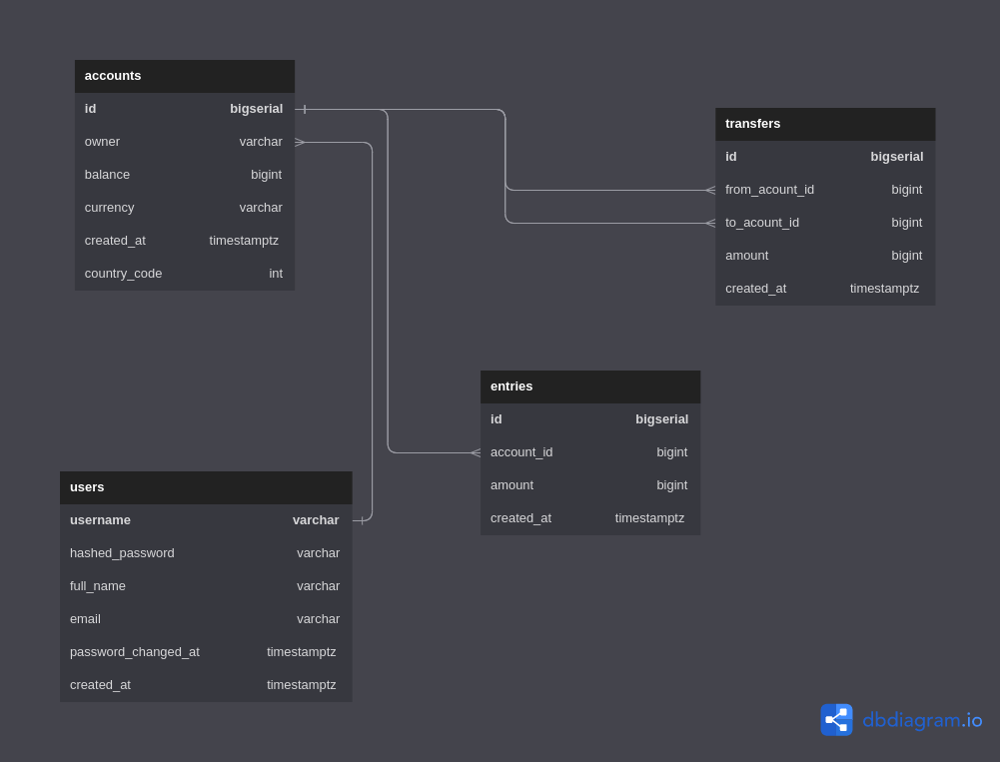

# dummy-bank-golang
This is a simple simulation of a bank API service that can store user information and perform transaction.

## DB Schema

## References
- DB Schema: [Db diagram](https://dbdiagram.io/home)
- Postgres: [Postgres Image Docker Hub](https://hub.docker.com/_/postgres)
- TablePlus: [TablePlus](https://tableplus.com/blog/2019/10/tableplus-linux-installation.html)
- Create DB migration scripts: [Golang migrate](https://github.com/golang-migrate/migrate)
- Init sqlc and generate config: [link](https://docs.sqlc.dev/en/stable/reference/config.html#version-1)
- Write sql query: [sqlc link](https://docs.sqlc.dev/en/stable/tutorials/getting-started-postgresql.html)
- Generate mock DB: [Golang mock](https://github.com/golang/mock)
- Validate Json structs: [Go playground validator](https://github.com/go-playground/validator)
- Generate UUID: [Google's UUID](https://github.com/google/uuid)
- Make JWT token: [Golang JWT](https://github.com/golang-jwt/jwt)

## Acknowledgement
- [Backend Masterclass playlist on youtube](https://www.youtube.com/playlist?list=PLy_6D98if3ULEtXtNSY_2qN21VCKgoQAE)
